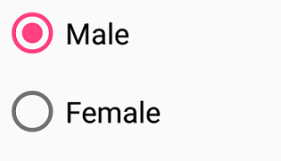

# Getting Started for Xamarin.Forms SfRadioButton
This is demo application of Xamarin.Forms SfRadioButton control. The minimal set of required properties have been configured in this project to get started with SfRadioButton in Xamarin.Forms.

For more details please refer the Xamarin.Forms SfRadioButton UG documentation [Getting Started](https://help.syncfusion.com/xamarin/radio-button/getting-started) link.

## <a name="requirements-to-run-the-demo"></a>Requirements to run the demo ##

* [Visual Studio 2019 or Visual Studio 2017](https://visualstudio.microsoft.com/downloads/) or [Visual Studio for Mac](https://visualstudio.microsoft.com/vs/mac/).
* Xamarin add-ons for Visual Studio (available via the Visual Studio installer).

## <a name="troubleshooting"></a>Troubleshooting ##
### Path too long exception
If you are facing path too long exception when building this example project, close Visual Studio and rename the repository to short and build the project.

## <a name="description"></a>Description ##

### Initialize SfRadioButton

Import the [`SfRadioButton`](https://help.syncfusion.com/cr/xamarin/Syncfusion.XForms.Buttons.SfRadioButton.html) namespace as shown below in your respective Page,

###### Xaml
```xaml
xmlns:syncfusion="clr-namespace:Syncfusion.XForms.Buttons;assembly=Syncfusion.Buttons.XForms"
```
###### C#
```C#
using Syncfusion.XForms.Buttons;
```

The two different visual states of the [`SfRadioButton`](https://help.syncfusion.com/cr/xamarin/Syncfusion.XForms.Buttons.SfRadioButton.html) are:

* Checked
* Unchecked

You can change the state of the radio button using the [`IsChecked`](https://help.syncfusion.com/cr/xamarin/Syncfusion.XForms.Buttons.ToggleButton.html#Syncfusion_XForms_Buttons_ToggleButton_IsChecked) property of [`SfRadioButton`](https://help.syncfusion.com/cr/xamarin/Syncfusion.XForms.Buttons.SfRadioButton.html). In the checked state, an inner circle is added to the visualization of radio button.

The radio buttons are used when there is a list of two or more options or group that are mutually exclusive and the user must select exactly one choice, such as “Select Gender” or “Choose the best option!”.

###### Xaml
```xaml
<syncfusion:SfRadioGroup x:Name="radioGroup">
     <syncfusion:SfRadioButton x:Name="male" Text="Male" IsChecked="True"/>
     <syncfusion:SfRadioButton x:Name="female" Text="Female"/>
</syncfusion:SfRadioGroup>
```
###### C#
```C#
SfRadioGroup radioGroup = new SfRadioGroup();
SfRadioButton male = new SfRadioButton();
male.IsChecked = true;
male.Text = "Male";
SfRadioButton female = new SfRadioButton();
female.Text = "Female";
radioGroup.Children.Add(male);
radioGroup.Children.Add(female);
```
> **_NOTE:_**  [`SfRadioButton`](https://help.syncfusion.com/cr/xamarin/Syncfusion.XForms.Buttons.SfRadioButton.html) are mutually exclusive among them when they are defined within [`SfRadioGroup`](https://help.syncfusion.com/cr/xamarin/Syncfusion.XForms.Buttons.SfRadioGroup.html).

## <a name="output"></a>Output ##


